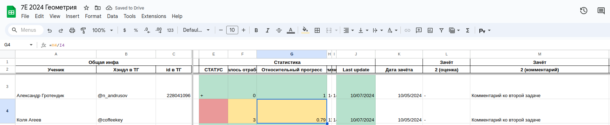

# Бот с хвостами по геометрии (Территория-Е)

Добро пожаловать в репозиторий проекта "бот с хвостами по геометрии"
Это бот, который обращается к Google-таблице препа (Никиты, в данном случае), в которой хранится вся информация о хвостах и отработках учеников 7-го класса по геометрии.

Данные хранятся в таблице, которая устроена примерно как на картинке:

Дальше в таблице идут столбцы с данными по разным задачам из зачёта, РНО, Перезачёта, и так далее, а ещё данные с характеристиками, отработками, итоговой оценкой...

Телеграм-бот читает эту таблицу и каждому ученику отвечает про то, что ему/ей ещё осталось закрыть по какой сессии.

В репозитории есть несколько файлов:
- [Этот файл с описанием проекта](README.md)
- [Файл с картинкой из этого ридми](example.png)
- [Системный файл для работы репозитория](.gitignore)
- [Файл с информацией о необходимых библиотеках Python для работы программы](requirements.txt)
- [Скрипт для подготовки бота к работе](setup.sh)
- [Основной файл с кодом программы](main.py)

В коде программы достаточно подробно комментариями описано, что именно делает каждая функция. В боте есть команда-пасхалка, которую можно найти, если прочитать код: отправка этой команды известит админа бота о том, что вы справились отыскать эту секретную команду!

## Как сделать себе такого же бота?
Процедура непростая, но посильная:
- Сделайте таблицу с хвостами по примеру таблицы Никиты
- Создайте телеграм-бота с помощью [Botfather](https://t.me/BotFather). [Инструкция, как это сделать](https://botcreators.ru/blog/botfather-instrukciya/)
- Создайте аккаунт в Google API Console, чтобы предоставить боту автоматический доступ к таблице. [Инструкция, как это сделать](https://docs.gspread.org/en/latest/oauth2.html#for-bots-using-service-account)
- Зайдите на свой linux-сервер, на котором вы планируете хостить бота
- Скачайте репозиторий: `git clone https://github.com/AndrusovN/e_geom_bot`
- Перейдите в директорию с проектом: `cd e_geom_bot`
- Запустите скрипт для начальной подготовки: `sudo chmod +x setup.sh && ./setup.sh`
- Положите в папку с ботом ваш `json`-файл от Google API Console
- Узнайте свой телеграм-id и телеграм-id классрука. Для этого можно отправить сообщение [UserInfo боту](https://t.me/userinfobot).
- Создайте в той же папке файл `.env` с таким содержимым:
```
SHEET_URL=ссылка на вашу гугл-таблицу
BOT_API_TOKEN=токен вашего телеграм-бота
ADMIN_ID=телеграм-id админа (вас)
MAIN_TEACHER_ID=телеграм-id классрука
GOOGLE_SECRET_FILENAME=название вашего json-файла от Google API Console
```
- Запускайте бота и наслаждайтесь!
`python3 main.py`